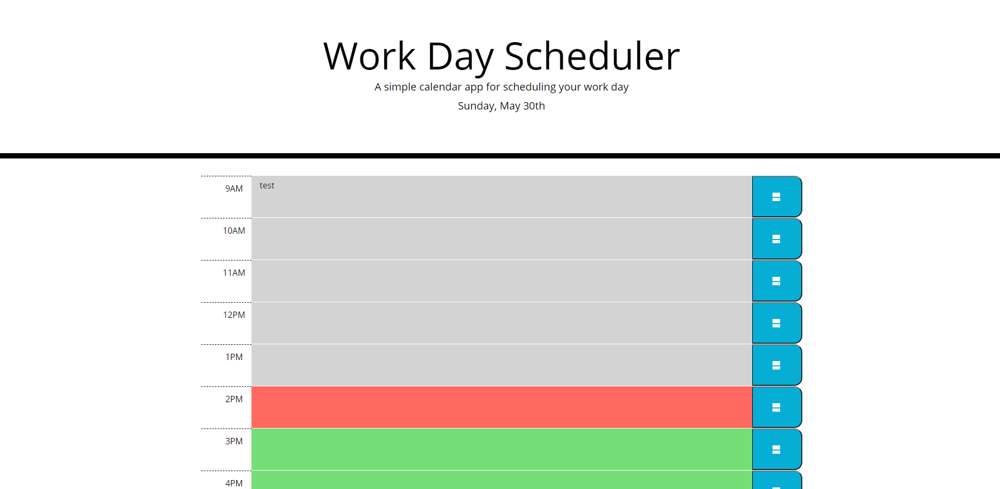

# Work Day Scheduler
- A day planner with editable text areas per hour from 9-5.
- Color coded hours for past present and future visualization
- A save button to keep data between sessions and reloads
- Displays current date in the title
[Launch Application](https://drad9428.github.io/work-day-scheduler/)

